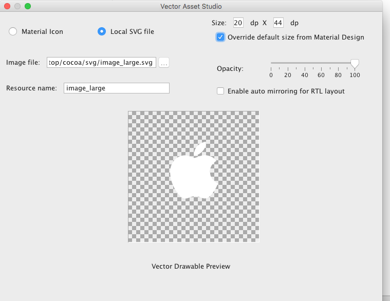

# [fit] iOSとAndroidのSVGについて軽く話すよー

---

# About me

**新見 晃平**

株式会社ヤマップという会社で、[YAMAP](https://yamap.co.jp/)のAndroidアプリなどを作っているエンジニアです。

- Twitter: @gupuru
- GitHub: gupuru

---

# [fit] ちなみに、ヤマップは、どんな企業かと言うと…

---

# 犬が社長です！


---

# [fit] あとは、おまけなので、適当に聞いて`(*´ω｀*)`

---

# おまけの内容

- SVGって何？
- iOSのSVG
- AndroidのSVG　

---

# SVGって何？

---


---

#　このへんのやつ


---

# SVG（Scalable Vector Graphics）

- ベクターデータ
- XML

---

```

<?xml version="1.0" encoding="utf-8"?>
<!-- Generator: Adobe Illustrator 18.0.0, SVG Export Plug-In . SVG Version: 6.00 Build 0)  -->
<!DOCTYPE svg PUBLIC "-//W3C//DTD SVG 1.1//EN" "http://www.w3.org/Graphics/SVG/1.1/DTD/svg11.dtd">
<svg version="1.1" xmlns="http://www.w3.org/2000/svg" xmlns:xlink="http://www.w3.org/1999/xlink" x="0px" y="0px" width="20px"
	 height="44px" viewBox="0 0 20 44" enable-background="new 0 0 20 44" xml:space="preserve">
<g id="FPO">
</g>
<g id="Global_Nav_Small_Icons">
</g>
<g id="Global_Nav_Small_1_">
</g>
<g id="Bag">
</g>
<g id="Global_Nav_Large_Icons">
	<path id="Apple" fill="#FFFFFF" d="M18.1,24.227c-0.106,0.307-0.217,0.6-0.335,0.881c-0.288,0.664-0.628,1.275-1.022,1.836
		c-0.536,0.766-0.976,1.296-1.315,1.59c-0.525,0.483-1.088,0.731-1.691,0.744c-0.433,0-0.954-0.123-1.562-0.372
		c-0.609-0.249-1.169-0.372-1.681-0.372c-0.537,0-1.113,0.123-1.729,0.372c-0.617,0.249-1.114,0.38-1.494,0.392
		c-0.578,0.025-1.154-0.229-1.729-0.764c-0.367-0.32-0.826-0.869-1.376-1.646c-0.59-0.83-1.075-1.793-1.455-2.891
		C2.304,22.812,2.1,21.664,2.1,20.553c0-1.273,0.275-2.371,0.826-3.291c0.433-0.739,1.009-1.322,1.73-1.75
		c0.721-0.428,1.5-0.646,2.339-0.66c0.459,0,1.061,0.142,1.809,0.421c0.746,0.28,1.225,0.422,1.435,0.422
		c0.157,0,0.689-0.166,1.591-0.497c0.853-0.307,1.573-0.434,2.163-0.384c1.598,0.129,2.798,0.759,3.597,1.894
		c-1.429,0.866-2.136,2.079-2.122,3.635c0.013,1.212,0.452,2.221,1.316,3.022C17.176,23.736,17.614,24.023,18.1,24.227z
		 M14.08,10.305c0.013,0.127,0.019,0.254,0.019,0.38c0,0.95-0.347,1.837-1.038,2.658c-0.835,0.976-1.845,1.54-2.94,1.451
		c-0.014-0.114-0.022-0.234-0.022-0.36c0-0.912,0.397-1.888,1.102-2.686c0.352-0.404,0.8-0.74,1.342-1.008
		C13.085,10.476,13.598,10.33,14.08,10.305z"/>
</g>
<g id="Global_Nav_Large_1_">
</g>
<g id="Guides">
</g>
<g id="NOTES">
</g>
</svg>

```
---

# SVG（Scalable Vector Graphics）

- ベクターデータ
- XML
- アニメーション
- 拡大縮小しても荒くならない

---

### SVGは、なんで拡大縮小しても荒くならないの？？

- 点の座標位置や点同士を結ぶ線を計算し、さらに画像の拡大や縮小も画質を計算して表示しているから。
- ちなみに、ベクターデータが最も利用されているは、フォント（アウトラインフォント）だそうです。
- もっと知りたくなっらら、**ググッてｗ**

---

## 拡大縮小しても荒くならないので...

- SVGの1ファイルだけ用意すれば、**解像度に応じた画像を用意する必要がない！**
- 今後、さらに解像度があがり@4x, xxxxxhdpiなどの対応が必要になった時も、**新しく画像を用意しないくていい!!**
- アプリの容量も減らせる( *• ̀ω•́ )b

---

# デメリットもあるよ...

- レンダリングが必要なので、デバイスの性能によっては描画が遅くなる
- 内容によっては、pngよりもファイルサイズが大きくなる
- 写真には使えない

---

# [fit] iOSのSVG対応

---

# [fit] iOSでは、この辺を使うとSVGが使えます(･ω･)b

- ライブラリ(SVGKit, SwiftSVG)
- アプリ(PaintCode 3)

---

# SVGKit

https://github.com/SVGKit/SVGKit

CocoaPodsで追加

```
  pod 'SVGKit', :git => 'https://github.com/SVGKit/SVGKit.git', :branch => '2.x'
```

---

# [fit] Resources作って、そこにSVGをいれてねー


---

# [fit] あとは、こんな感じにやればOK

```swift
@IBOutlet weak var svgWindowsImageView: UIImageView!

override func viewDidLoad() {
	super.viewDidLoad()
	
	let svgImage = SVGKImage(named: "windows")
	svgImage?.size = svgWindowsImageView.bounds.size
	svgWindowsImageView.image = svgImage?.uiImage
	
}
```


---

# PaintCode 3

- drawrectエディター
- 12,532円(2017/1/20)
- swift3.0対応！あと、Androidも！！もちろん、JavaScriptも！！！

---


---

```swift
//// Color Declarations
let fillColor = UIColor(red: 0.139, green: 0.508, blue: 0.755, alpha: 1.000)
let fillColor2 = UIColor(red: 0.951, green: 0.951, blue: 0.951, alpha: 1.000)

//// windows.svg Group
//// Oval Drawing
let ovalPath = UIBezierPath(ovalIn: CGRect(x: 0, y: 0, width: 512, height: 512))
fillColor.setFill()
ovalPath.fill()

//// Bezier Drawing
let bezierPath = UIBezierPath()
bezierPath.move(to: CGPoint(x: 232, y: 246.52))
bezierPath.addCurve(to: CGPoint(x: 232, y: 129.53), controlPoint1: CGPoint(x: 232, y: 207.52), controlPoint2: CGPoint(x: 232, y: 168.53))
bezierPath.addCurve(to: CGPoint(x: 120, y: 148.48), controlPoint1: CGPoint(x: 192, y: 135.86), controlPoint2: CGPoint(x: 159.46, y: 142.16))
bezierPath.addCurve(to: CGPoint(x: 120, y: 247.93), controlPoint1: CGPoint(x: 120, y: 188.26), controlPoint2: CGPoint(x: 120, y: 208.15))
bezierPath.addCurve(to: CGPoint(x: 232, y: 246.52), controlPoint1: CGPoint(x: 159.46, y: 247.47), controlPoint2: CGPoint(x: 192, y: 246.98))
bezierPath.close()
fillColor2.setFill()
bezierPath.fill()

//// Bezier 2 Drawing
let bezier2Path = UIBezierPath()
bezier2Path.move(to: CGPoint(x: 248, y: 246.28))
bezier2Path.addCurve(to: CGPoint(x: 376, y: 244.86), controlPoint1: CGPoint(x: 288, y: 245.8), controlPoint2: CGPoint(x: 336.54, y: 245.35))
bezier2Path.addCurve(to: CGPoint(x: 376, y: 107.52), controlPoint1: CGPoint(x: 376, y: 199.08), controlPoint2: CGPoint(x: 376, y: 153.3))
bezier2Path.addCurve(to: CGPoint(x: 248, y: 126.47), controlPoint1: CGPoint(x: 336.54, y: 113.84), controlPoint2: CGPoint(x: 288, y: 120.14))
bezier2Path.addCurve(to: CGPoint(x: 248, y: 246.28), controlPoint1: CGPoint(x: 248, y: 166.41), controlPoint2: CGPoint(x: 248, y: 206.34))
bezier2Path.close()
fillColor2.setFill()
bezier2Path.fill()

//// Bezier 3 Drawing
let bezier3Path = UIBezierPath()
bezier3Path.move(to: CGPoint(x: 249.6, y: 265.72))
bezier3Path.addCurve(to: CGPoint(x: 249.6, y: 385.54), controlPoint1: CGPoint(x: 249.58, y: 305.66), controlPoint2: CGPoint(x: 249.6, y: 345.6))
bezier3Path.addCurve(to: CGPoint(x: 376, y: 404.48), controlPoint1: CGPoint(x: 289.06, y: 391.86), controlPoint2: CGPoint(x: 336.53, y: 398.16))
bezier3Path.addCurve(to: CGPoint(x: 376, y: 267.14), controlPoint1: CGPoint(x: 376, y: 358.7), controlPoint2: CGPoint(x: 376, y: 312.91))
bezier3Path.addCurve(to: CGPoint(x: 249.6, y: 265.72), controlPoint1: CGPoint(x: 336.54, y: 266.67), controlPoint2: CGPoint(x: 289.07, y: 266.19))
bezier3Path.close()
fillColor2.setFill()
bezier3Path.fill()

//// Bezier 4 Drawing
let bezier4Path = UIBezierPath()
bezier4Path.move(to: CGPoint(x: 232, y: 265.48))
bezier4Path.addCurve(to: CGPoint(x: 120, y: 264.06), controlPoint1: CGPoint(x: 192, y: 265.01), controlPoint2: CGPoint(x: 159.46, y: 264.54))
bezier4Path.addCurve(to: CGPoint(x: 120, y: 363.52), controlPoint1: CGPoint(x: 120, y: 303.85), controlPoint2: CGPoint(x: 120, y: 323.74))
bezier4Path.addCurve(to: CGPoint(x: 232, y: 382.46), controlPoint1: CGPoint(x: 159.46, y: 369.85), controlPoint2: CGPoint(x: 192, y: 376.14))
bezier4Path.addCurve(to: CGPoint(x: 232, y: 265.48), controlPoint1: CGPoint(x: 232, y: 343.47), controlPoint2: CGPoint(x: 232, y: 304.48))
bezier4Path.close()
fillColor2.setFill()
bezier4Path.fill()
```

---

# [fit] Exportで、swiftファイル書き出して、プロジェクトに入れてー


---

# [fit] コードで指定する場合は、こんな感じ

```swift
	hogehoge.image = WindowsStyleKit.imageOfWindows
```


---

# [fit] storyboardでやる場合は、こんな感じ

```swift
import UIKit

@IBDesignable
class WindowsView: UIView {
    override func draw(_ rect: CGRect) {
        WindowsStyleKit.drawWindows()
    }
}
```


---

# [fit] SVGアニメーションっぽいこと

```swift

@IBOutlet weak var windowsView: WindowsView!

func rotateView() {
	UIView.animate(withDuration: 0.5, delay: 0, options: .curveLinear, animations: {
		self.windowsView!.transform =
			self.windowsView!.transform.rotated(by: CGFloat(M_PI_2))
		}, completion: { finished in
			self.rotateView()
	})
}
```


---

# [fit] AndroidのSVG対応

---

# Androidで、PaintCode 3を使う

## http://qiita.com/gupuru/items/38d29cee66fc956bd30a

---

## [fit] Android 5.0(Lollipop)より、ベクター画像が普通に使えます。
## [fit] 5.0より下は、SupportLibraryを使うことで、表示が可能！

```
    <ImageView
        android:id="@+id/hogehoge"
        android:layout_width="wrap_content"
        android:layout_height="wrap_content"
        android:src="@drawable/ic_hogehoge_vector_24dp" />
```

---

svgファイルをそのままでは使えないので`<vector>`に変換する必要があります。
この辺は、Android Studioの**Vector Asset**を使えば、簡単にできます！


---

# [fit] `Local...`を選んでもらって、svgファイルを指定します


---

# [fit] ちゃんと読み込めると、こんな感じにプレビューが表示されます



---

# [fit] そして、こんな感じに変換してくれます


---

あ！ちなみに、**Vector Asset**には、こんな感じのアイコンも用意してくれているので、こっちを使うのもアリ！


---

# 下準備

### gradleに、これを入れてください


```
defaultConfig {
    ...
    vectorDrawables.useSupportLibrary = true
    ...
  }
```

---

# [fit] svgを表示するにはsrcCompatを使います。

```
 <ImageView
        android:layout_width="wrap_content"
        android:layout_height="wrap_content"
        app:srcCompat="@drawable/hogehoge"/>
```


---

# アニメーション

**AnimatedVectorDrawable**を使うよ(^O^)／

**画面撮るの忘れたｗｗ**

---

### vector

```xml
<vector xmlns:android="http://schemas.android.com/apk/res/android"
    android:width="20dp"
    android:height="44dp"
    android:viewportHeight="44.0"
    android:viewportWidth="20.0">

    <group
        android:name="apple">

    <path
        android:fillColor="#000"
        android:pathData="M18.1,24.227c-0.106,...3,0.1272.658c-0.85z" />

    </group>
</vector>
```

---

### animated-vector

```xml
<?xml version="1.0" encoding="utf-8"?>
<animated-vector xmlns:android="http://schemas.android.com/apk/res/android"
    android:drawable="@drawable/apple" >
    <target
        android:name="apple"
        android:animation="@anim/rotate" />

</animated-vector>
```

---

### objectAnimator

```xml
<set xmlns:android="http://schemas.android.com/apk/res/android">

    <objectAnimator
        android:duration="6000"
        android:propertyName="rotation"
        android:valueFrom="0"
        android:valueTo="360" />

</set>
```

---

### startで実行

```java

ImageView appleImageView = (ImageView) findViewById(R.id.image_apple);

AnimatedVectorDrawable d = (AnimatedVectorDrawable) ContextCompat.getDrawable(this, R.drawable.rotete_apple);
appleImageView.setImageDrawable(d);
d.start();
```

---

# まとめ

---

# SVGのやりやすさはAndroidの方が上だけど...

---

# [fit] iPhoneも負けてないぞ！

---

#　最後に言い忘れたことが...

---

#[fit] 社長の名前は、ハナちゃんです（笑）

---

# [fit] 最後までご清聴ありがとうございました！