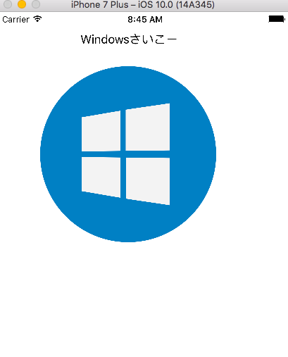

# [fit] iOSとAndroidのSVGについて軽く話すよー

---

# About me

**新見 晃平**

福岡にある株式会社セフリという会社で、[YAMAP](https://yamap.co.jp/)のAndroidアプリを作っている**社畜**エンジニアです。
最近は、Docker, TensorFlow, Angular 2などやっていてiOS全然できてない（泣）

- Twitter: @gupuru
- GitHub: gupuru

---

# [fit] セフリは、どんな企業かと言うと…社長が犬です！


---

# [fit] YAMAPダウンロードしてねー


---

# [fit] あとは、おまけなので、適当に聞いて`(*´ω｀*)`

---

# おまけの内容

- SVGって何？
- iOSのSVG
- AndroidのSVG　

---

# SVGって何？

---


---

#　このへんのやつ


---

# SVG（Scalable Vector Graphics）

- ベクターデータ
- XML

---

```

<?xml version="1.0" encoding="utf-8"?>
<!-- Generator: Adobe Illustrator 18.0.0, SVG Export Plug-In . SVG Version: 6.00 Build 0)  -->
<!DOCTYPE svg PUBLIC "-//W3C//DTD SVG 1.1//EN" "http://www.w3.org/Graphics/SVG/1.1/DTD/svg11.dtd">
<svg version="1.1" xmlns="http://www.w3.org/2000/svg" xmlns:xlink="http://www.w3.org/1999/xlink" x="0px" y="0px" width="20px"
	 height="44px" viewBox="0 0 20 44" enable-background="new 0 0 20 44" xml:space="preserve">
<g id="FPO">
</g>
<g id="Global_Nav_Small_Icons">
</g>
<g id="Global_Nav_Small_1_">
</g>
<g id="Bag">
</g>
<g id="Global_Nav_Large_Icons">
	<path id="Apple" fill="#FFFFFF" d="M18.1,24.227c-0.106,0.307-0.217,0.6-0.335,0.881c-0.288,0.664-0.628,1.275-1.022,1.836
		c-0.536,0.766-0.976,1.296-1.315,1.59c-0.525,0.483-1.088,0.731-1.691,0.744c-0.433,0-0.954-0.123-1.562-0.372
		c-0.609-0.249-1.169-0.372-1.681-0.372c-0.537,0-1.113,0.123-1.729,0.372c-0.617,0.249-1.114,0.38-1.494,0.392
		c-0.578,0.025-1.154-0.229-1.729-0.764c-0.367-0.32-0.826-0.869-1.376-1.646c-0.59-0.83-1.075-1.793-1.455-2.891
		C2.304,22.812,2.1,21.664,2.1,20.553c0-1.273,0.275-2.371,0.826-3.291c0.433-0.739,1.009-1.322,1.73-1.75
		c0.721-0.428,1.5-0.646,2.339-0.66c0.459,0,1.061,0.142,1.809,0.421c0.746,0.28,1.225,0.422,1.435,0.422
		c0.157,0,0.689-0.166,1.591-0.497c0.853-0.307,1.573-0.434,2.163-0.384c1.598,0.129,2.798,0.759,3.597,1.894
		c-1.429,0.866-2.136,2.079-2.122,3.635c0.013,1.212,0.452,2.221,1.316,3.022C17.176,23.736,17.614,24.023,18.1,24.227z
		 M14.08,10.305c0.013,0.127,0.019,0.254,0.019,0.38c0,0.95-0.347,1.837-1.038,2.658c-0.835,0.976-1.845,1.54-2.94,1.451
		c-0.014-0.114-0.022-0.234-0.022-0.36c0-0.912,0.397-1.888,1.102-2.686c0.352-0.404,0.8-0.74,1.342-1.008
		C13.085,10.476,13.598,10.33,14.08,10.305z"/>
</g>
<g id="Global_Nav_Large_1_">
</g>
<g id="Guides">
</g>
<g id="NOTES">
</g>
</svg>

```
---

# SVG（Scalable Vector Graphics）

- ベクターデータ
- XML
- アニメーション
- 拡大縮小しても荒くならない

---

### SVGは、なんで拡大縮小しても荒くならないの？？

- 点の座標位置や点同士を結ぶ線を計算し、さらに画像の拡大や縮小も画質を計算して表示しているから。
- ちなみに、ベクターデータが最も利用されているは、フォント（アウトラインフォント）だそうです。
- もっと知りたくなっらら、**ググッてｗ**

---

## 拡大縮小しても荒くならないので...

- SVGの1ファイルだけ用意すれば、**解像度に応じた画像を用意する必要がない！**
- 今後、さらに解像度があがり@4x, xxxxxhdpiなどの対応が必要になった時も、**新しく画像を用意しないくていい!!**
- アプリの容量も減らせる( *• ̀ω•́ )b

---

# デメリットもあるよ...

- レンダリングが必要なので、デバイスの性能によっては描画が遅くなる
- 内容によっては、pngよりもファイルサイズが大きくなる
- 写真には使えない

---

# [fit] iOSのSVG対応

---

# [fit] iOSでは、この辺を使うとSVGが使えます(･ω･)b

- ライブラリ(SVGKit, SwiftSVG)
- アプリ(PaintCode)

---

# SVGKit

https://github.com/SVGKit/SVGKit

CocoaPodsで追加

```
  pod 'SVGKit', :git => 'https://github.com/SVGKit/SVGKit.git', :branch => '2.x'
```

---

# [fit] Resources作って、そこにSVGをいれてねー


---

# [fit] あとは、こんな感じにやればOK

```swift
@IBOutlet weak var svgWindowsImageView: UIImageView!

override func viewDidLoad() {
	super.viewDidLoad()
	
	let svgImage = SVGKImage(named: "windows")
	svgImage?.size = svgWindowsImageView.bounds.size
	svgWindowsImageView.image = svgImage?.uiImage
	
}
```


---

# PaintCode

- drawrectエディター
- 11,409円(2016/9/15)
- swift3.0に未対応(2016/9/15)

---


---

# [fit] Exportで、swiftファイル書き出して、プロジェクトに入れてー


---

# [fit] いろいろエラーがでるので、修正してね(swift3.0未対応のため)


---

# [fit] コードで指定する場合は、こんな感じ

```swift
	hogehoge.image = WindowsStyleKit.imageOfWindows
```



---

# [fit] storyboardでやる場合は、こんな感じ

```swift
import UIKit

@IBDesignable
class WindowsView: UIView {
    override func draw(_ rect: CGRect) {
        WindowsStyleKit.drawWindows()
    }
}
```


---

# [fit] SVGアニメーションっぽいこと

```swift

@IBOutlet weak var windowsView: WindowsView!

func rotateView() {
	UIView.animate(withDuration: 0.5, delay: 0, options: .curveLinear, animations: {
		self.windowsView!.transform =
			self.windowsView!.transform.rotated(by: CGFloat(M_PI_2))
		}, completion: { finished in
			self.rotateView()
	})
}
```


---

# [fit] AndroidのSVG対応

---

# gradleに、これを入れてください。


```
defaultConfig {
    ...
    vectorDrawables.useSupportLibrary = true
    ...
  }
```

---

svgファイルはそのままでは使えないので`<vector>`に変換する必要があります。
この辺は、Android Studioの**Vector Asset**を使えば、簡単にできます！


---

# `Local...`を選んでもらって...


---

# ちゃんと読み込めると、こんな感じにプレビューが表示されます。


---

# そして、こんな感じに変換してくれます。


---

あ！ちなみに、**Vector Asset**には、こんな感じのアイコンも用意してくれているので、こっちを使うのもアリ！


---

# [fit] svgを表示するにはsrcCompatを使います。

```
 <ImageView
        android:layout_width="wrap_content"
        android:layout_height="wrap_content"
        app:srcCompat="@drawable/hogehoge"/>
```


---

# まとめ

---

# SVGのやりやすさはAndroidの方が上だけど...

---

# [fit] iPhoneも負けてないぞ！

---

# でも、Windowsは完全に負けてます（笑）

---

# [fit] ありがとうございました！